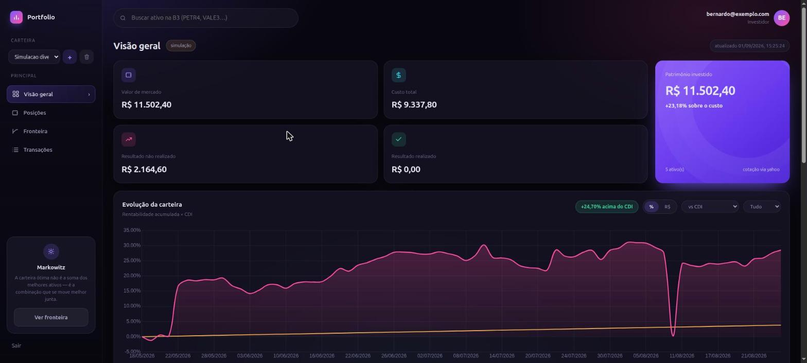
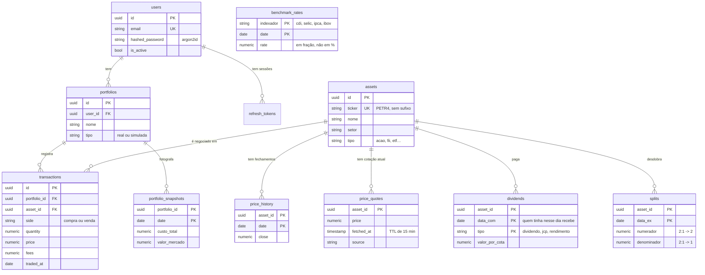
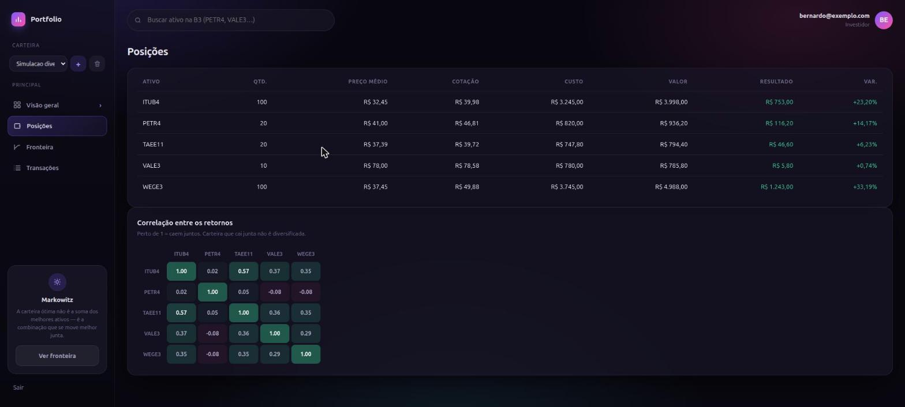
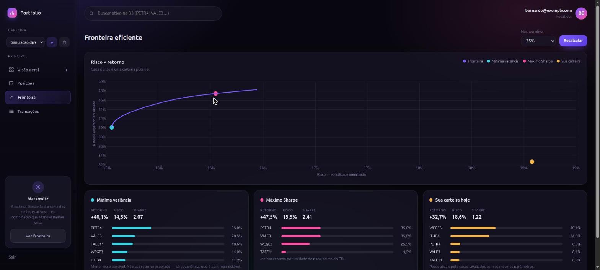
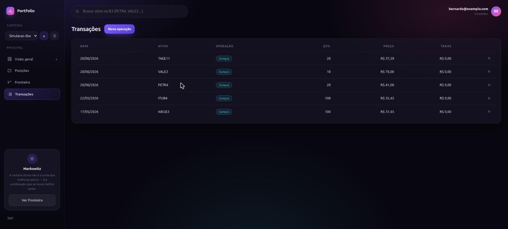

# Portfolio Tracker API

Uma API que responde três perguntas sobre uma carteira da B3:

1. **Quanto eu tenho?** — posição, preço médio, lucro e prejuízo
2. **Fui bem?** — comparado ao CDI, à Selic, à inflação e ao Ibovespa
3. **Poderia ser melhor?** — a fronteira eficiente de Markowitz, sobre os seus ativos

Você registra as compras e vendas. Todo o resto é calculado a partir disso — não existe
uma coluna "saldo" em lugar nenhum do banco.



**Stack:** Python 3.12 · FastAPI · SQLAlchemy 2.0 async · PostgreSQL 17 · Alembic ·
pytest + testcontainers · uv · ruff · mypy strict

**Tamanho:** 7.839 linhas em `app/`, 6.236 em testes, **442 testes**, 95% de cobertura,
28 endpoints, 12 tabelas.

---

## Índice

- [A ideia central: o livro é a verdade](#a-ideia-central-o-livro-é-a-verdade)
- [Como rodar](#como-rodar)
- [O caminho de um pedido](#o-caminho-de-um-pedido)
- [As tabelas e como se ligam](#as-tabelas-e-como-se-ligam)
- [O que cada parte do código faz](#o-que-cada-parte-do-código-faz)
- [As telas](#as-telas)
- [A fronteira eficiente, sem fórmula](#a-fronteira-eficiente-sem-fórmula)
- [Decisões que valem explicar](#decisões-que-valem-explicar)
- [Erros que ficaram registrados](#erros-que-ficaram-registrados)

---

## A ideia central: o livro é a verdade

Se você entender só uma coisa deste projeto, que seja esta.

O banco **não guarda quanto você tem**. Ele guarda o que você fez:

```
20/08/2026   COMPRA   45 TAEE11   a R$ 37,39
```

Posição, preço médio, lucro, rentabilidade — tudo isso é recalculado a partir do
livro de transações, a cada consulta.

Parece trabalho desnecessário. Não é. Guardar o saldo cria dois lugares onde a
verdade pode morar, e um dia eles discordam: você apaga uma compra antiga e o saldo
não acompanha. Com uma fonte só, **o extrato sempre explica o saldo** — porque o
saldo *é* o extrato, somado.

Isso governa três coisas que parecem separadas e não são:

| Situação | O que acontece |
|---|---|
| Você apaga uma transação | O histórico do gráfico é reconstruído sozinho |
| A TAEE11 paga dividendo | Quanto você recebeu vem de quantas cotas o livro dizia ter naquele dia |
| A WEGE3 desdobra 2:1 | Suas 100 cotas viram 200 na leitura, e o livro nem é tocado |

---

## Como rodar

Você precisa de **Docker** e **[uv](https://docs.astral.sh/uv/)**.

```bash
git clone https://github.com/timmtimm1/portfolio-api.git
cd portfolio-api

cp .env.example .env        # e edite: SECRET_KEY e POSTGRES_PASSWORD
make banco                  # sobe o Postgres
make migrar                 # cria as tabelas
make api                    # sobe a API com reload
```

Abra **http://localhost:8000/painel/** para a interface, ou
**http://localhost:8000/docs** para a documentação interativa da API.

Outros comandos:

```bash
make testes      # roda a suíte
make cobertura   # suíte com relatório de cobertura
make verificar   # tudo que o CI roda: lint, tipos e testes
```

---

## O caminho de um pedido

Vamos seguir um `GET /portfolio/summary` do começo ao fim. Todo endpoint segue esse
mesmo formato.

```
  Navegador
     │
     │  GET /api/v1/portfolio/summary?portfolio_id=…
     ▼
┌─────────────────────────────────────────────────────────┐
│  app/routers/     Fala HTTP. Recebe, valida, responde.  │
│                   Não sabe fazer conta.                 │
└─────────────────────────────────────────────────────────┘
     │  Quem é você? (JWT)  ·  Esta carteira é sua?
     ▼
┌─────────────────────────────────────────────────────────┐
│  app/core/deps.py    As dependências: sessão de banco,  │
│                      usuário atual, carteira atual.     │
└─────────────────────────────────────────────────────────┘
     │
     ▼
┌─────────────────────────────────────────────────────────┐
│  app/services/    Onde mora a regra. Lê o livro, ajusta │
│                   por desdobramento, calcula a posição. │
└─────────────────────────────────────────────────────────┘
     │                                    │
     ▼                                    ▼
┌──────────────────────┐    ┌──────────────────────────────┐
│  app/models/         │    │  app/clients/                │
│  As tabelas          │    │  brapi, Yahoo, Banco Central │
└──────────────────────┘    └──────────────────────────────┘
     │
     ▼
┌─────────────────────────────────────────────────────────┐
│  app/schemas/     Molda a resposta. Decide o que sai --  │
│                   e o que NÃO sai (o `user_id`, por ex.) │
└─────────────────────────────────────────────────────────┘
```

A regra que mantém isso honesto: **cada camada só fala com a de baixo.** Um router
nunca escreve SQL; um serviço nunca sabe o que é um código HTTP. Quando você
precisar mexer em algo, isso diz exatamente onde procurar.

---

## As tabelas e como se ligam



### Lendo o diagrama: há dois mundos aqui

**O mundo do usuário** — `users`, `portfolios`, `transactions`, `portfolio_snapshots`.
São os seus dados. Tudo aqui tem dono, e nenhuma consulta atravessa de um usuário
para outro.

**O mundo do mercado** — `assets`, `price_history`, `price_quotes`, `dividends`,
`splits`, `benchmark_rates`. São fatos públicos, iguais para todo mundo. Repare que
**nenhuma dessas tabelas tem `user_id`** — e isso é deliberado.

A TAEE11 pagou R$ 0,60 por unit com data-com em 17/08/2026. Isso é verdade para
qualquer pessoa. **Quanto *você* recebeu** é o cruzamento desse fato com o seu livro
naquele dia — calculado na hora, não guardado.

Se eu gravasse "o Bernardo recebeu R$ 27,00", criaria a chance dos dois discordarem:
apagar uma compra antiga deixaria o provento gravado para sempre, referente a cotas
que a carteira nunca teve.

`benchmark_rates` é a única tabela sem ligação nenhuma — CDI e IPCA não pertencem a
ativo nem a usuário, são só séries do Banco Central.

### Volumes hoje

| Tabela | Linhas | O que é |
|---|---:|---|
| `price_history` | 37.268 | Um ano de fechamentos dos 151 ativos |
| `benchmark_rates` | 486 | CDI, Selic, IPCA e Ibovespa, dia a dia |
| `assets` | 151 | Catálogo da B3 |
| `portfolio_snapshots` | 77 | A foto diária das carteiras |
| `dividends` | 54 | Proventos anunciados |
| `splits` | 6 | Desdobramentos e bonificações |
| `transactions` | 6 | O livro |

---

## O que cada parte do código faz

### Os módulos puros: matemática sem banco

Estes quatro não sabem o que é SQL, HTTP ou ORM. Entram números, saem números — o
que os torna trivialmente testáveis e impossíveis de quebrar por acidente.

| Arquivo | O que faz |
|---|---|
| **`services/position.py`** | O preço médio brasileiro. Compra aumenta o custo; **venda não muda o preço médio** — mexe no resultado realizado. Taxa de compra entra no custo, taxa de venda sai do lucro. |
| **`services/metrics.py`** | Volatilidade, correlação, covariância. 252 pregões por ano, desvio-padrão *amostral*, retorno *geométrico* (CAGR) e não média simples. |
| **`services/optimizer.py`** | Markowitz. Recebe retornos esperados e covariância, devolve pesos. Resolve 50 problemas de otimização (SLSQP) para desenhar a fronteira. |
| **`services/dividend.py`** | Quanto você recebeu, dada a data-com. E o desconto de 15% quando é JCP. |
| **`services/split.py`** | Reescreve o livro nos termos de hoje. 100 ações antes de um 2:1 viram 200 a metade do preço — **e o custo total não muda**. |

### As camadas que falam com o mundo

| Pasta | Papel |
|---|---|
| **`app/routers/`** | Os 28 endpoints. Recebem, delegam, respondem. |
| **`app/services/*_service.py`** | Orquestram: leem do banco, chamam o módulo puro, gravam. |
| **`app/models/`** | As tabelas, em SQLAlchemy. |
| **`app/schemas/`** | A forma da resposta, em Pydantic. É aqui que se decide o que **não** sai. |
| **`app/clients/`** | Os fornecedores externos, cada um num arquivo. |
| **`app/core/`** | Configuração, banco, segurança, dependências, rate limit. |

### Os fornecedores externos

| Arquivo | De onde vem | O que traz |
|---|---|---|
| `clients/brapi.py` | brapi.dev | Cotação atual (fonte primária) |
| `clients/yahoo.py` | Yahoo Finance | Cotação de reserva, **proventos** e **desdobramentos** |
| `clients/bcb.py` | Banco Central (SGS) | CDI (série 12), Selic (11), IPCA (433) |
| `clients/ibov.py` | Yahoo Finance | Ibovespa — o BCB descontinuou a série em 2019 |
| `clients/composto.py` | — | Encadeia brapi → Yahoo: se o primeiro falha, o segundo completa |

Todos seguem a mesma regra: **falha externa nunca derruba a página.** Se o Banco
Central está fora do ar, a carteira aparece sem a linha do CDI e com uma frase
explicando por quê — nunca um erro 500.

---

## As telas

### Posições

Preço médio, cotação atual e resultado por ativo. O selo **`AJUSTADA`** aparece quando
a quantidade foi corrigida por desdobramento — sem ele, você veria 200 cotas na posição
e uma compra de 100 no extrato, e concluiria, com razão, que um dos dois está errado.



### Fronteira eficiente

A nuvem de carteiras possíveis, a curva na borda, e dois pontos marcados: a de menor
risco e a de melhor relação risco-retorno.



### Transações

O livro. Tudo o mais sai daqui.



---

## A fronteira eficiente, sem fórmula

A intuição errada é que o risco de uma carteira é a média dos riscos dos ativos.

Pegue dois ativos que oscilam 30% ao ano cada. Se sobem e descem **juntos**, a carteira
oscila 30%. Se andam em direções **opostas**, oscila bem menos — quando um cai, o outro
segura. Mesmo risco individual, risco de carteira completamente diferente.

Foi isso que Markowitz formalizou em 1952: o que importa não é o risco de cada ativo, é
**como eles se movem entre si**. Por isso a matriz de covariância é a entrada central do
cálculo.

**O que o gráfico mostra:** existem infinitas formas de dividir seu dinheiro entre os
seus ativos. Cada combinação vira um ponto — risco no eixo horizontal, retorno esperado
no vertical. A **fronteira é a borda superior esquerda** dessa nuvem: se uma carteira
cai *dentro* da nuvem, existe outra que dá mais retorno com o mesmo risco. Ela é
simplesmente pior.

**Como o código calcula** (`services/optimizer.py`): escolhe um retorno-alvo, pergunta
qual combinação o atinge com a menor volatilidade, e repete **50 vezes**. Sujeito a três
regras: os pesos somam 100%, nenhum é negativo, e nenhum ativo passa de 40%.

Esse limite de 40% não é matemática, é bom senso enfiado no modelo à força. Sem ele, o
otimizador rotineiramente joga quase tudo no papel que mais subiu na amostra —
matematicamente ótimo para o passado, e o oposto de diversificar.

> **A limitação que o código não esconde:** o modelo assume que o passado estima o
> futuro. Ele não estima. Mude a janela de observação em alguns meses e a carteira ótima
> muda completamente. O valor da fronteira é **mostrar o trade-off**, não entregar a
> resposta certa.

---

## Decisões que valem explicar

**`Decimal` para dinheiro, `float` para estatística.** Em ponto flutuante binário,
`0.1 + 0.2 == 0.30000000000000004`. Num preço médio somado sobre dezenas de transações,
isso vira centavo faltando. Já volatilidade e covariância são estimativas com incerteza
na terceira casa — usar `Decimal` ali seria precisão de mentira, e 100× mais lento. A
fronteira entre os dois mundos é explícita no código.

**JWT escrito à mão, não uma biblioteca de auth.** Access token de 15 minutos em
memória; refresh opaco de 384 bits em cookie `httpOnly`, guardado como SHA-256. Rotação
a cada uso, com detecção de reuso: se um token já usado reaparece, a família inteira é
revogada. Escrever isso ensinou mais do que instalar um pacote — e é a parte que um
entrevistador mais gosta de perguntar.

**O token nunca vai para o `localStorage`.** `localStorage` é legível por qualquer
script da página: uma dependência comprometida entrega a sessão. Aqui o token vive numa
variável e some ao fechar a aba; a sessão é retomada pelo cookie que o JavaScript não
consegue ler.

**Migrations, sempre — e lidas antes de rodar.** O `--autogenerate` já produziu, mais de
uma vez, um `DROP CONSTRAINT` em restrições corretas. Aplicar sem ler teria deixado o
banco aceitando qualquer string numa coluna que só deveria aceitar `compra` ou `venda`.

**`lazy="raise"` nos relacionamentos.** Um acesso não carregado levanta exceção em vez
de disparar uma consulta em silêncio. É a diferença entre descobrir um N+1 no primeiro
teste e descobrir em produção, seis meses depois, quando a página começa a demorar.

---

## Erros que ficaram registrados

Nenhum destes quebrou o sistema. Todos produziram um número plausível e errado — que é
a única categoria de defeito que realmente assusta num app de dinheiro.

| O que aconteceu | Por que passou despercebido |
|---|---|
| Cobertura reportava 83% falsos | O rastreador perdia o fluxo depois do primeiro `await` num contexto async |
| Login parecia recusar a senha certa | Era o rate limit (429), e a tela mostrava a mesma mensagem para qualquer falha |
| A tela de login não sumia após entrar | `display: grid` no CSS vence o atributo `hidden` do navegador |
| Duas abas deslogavam o usuário | Ambas renovavam com o mesmo token, e a detecção de reuso disparava |
| O gráfico congelava | Apagar uma transação não invalidava os snapshots já gravados |
| "Sem comparação" mostrava o CDI | O parâmetro tinha valor padrão, então *omitir* significava "use o padrão" |
| O retorno vinha subestimado | Proventos não entravam na conta: na data-com o preço cai, e o dinheiro recebido não aparecia |
| Sincronizar duas vezes duplicava provento | Reclassificar liberava a vaga na chave primária, e a segunda sincronização reinseria |

Cada um virou um teste com nome próprio. É por isso que a suíte tem 442 testes para
7.839 linhas de código.

---

## Licença

MIT.
